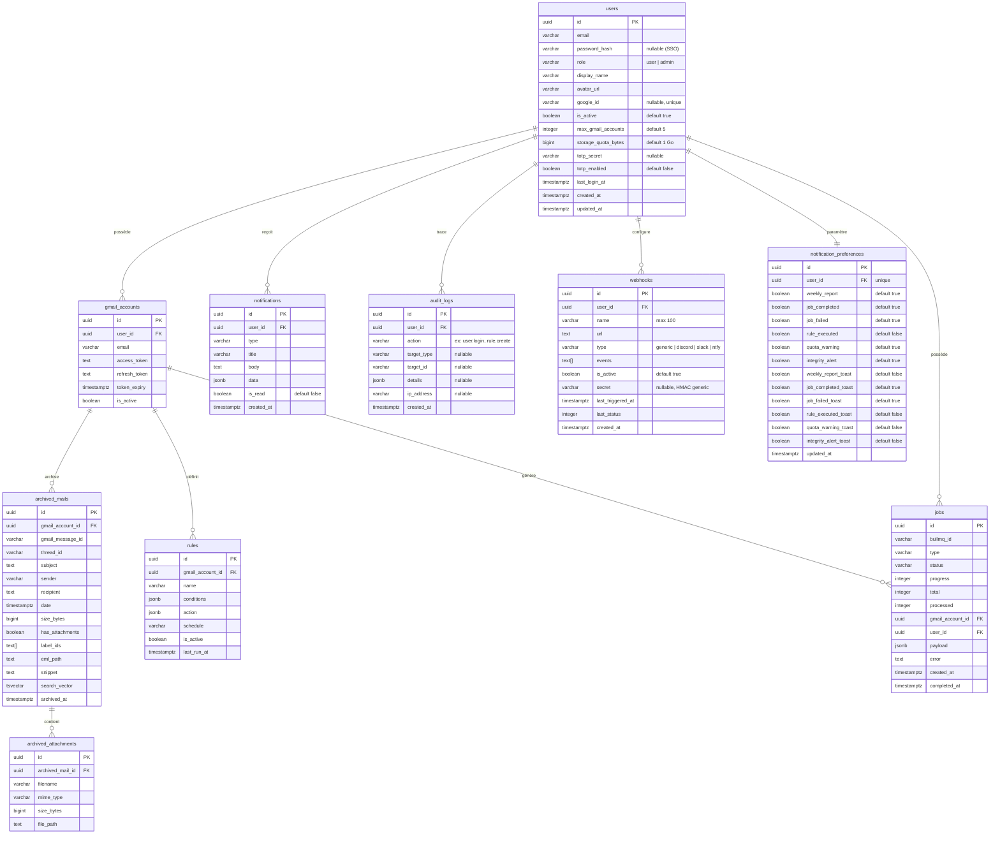

# Base de données

## Schéma ERD



---

## Index

| Table | Index | Type | Usage |
|---|---|---|---|
| `archived_mails` | `search_vector` | GIN | Recherche full-text |
| `archived_mails` | `gmail_account_id` | BTree | Filtrage par compte |
| `archived_mails` | `sender` | BTree | Filtrage par expéditeur |
| `archived_mails` | `date DESC` | BTree | Tri par date |
| `archived_mails` | `size_bytes DESC` | BTree | Tri par taille |
| `archived_attachments` | `archived_mail_id` | BTree | Join mails ↔ PJ |
| `jobs` | `gmail_account_id` | BTree | Filtrage jobs par compte |
| `jobs` | `status` | BTree | Filtrage par statut |
| `jobs` | `created_at DESC` | BTree | Tri par date |
| `jobs` | `user_id` | BTree | Filtrage jobs par utilisateur |
| `users` | `google_id` (partiel) | Unique | Lookup SSO Google |
| `audit_logs` | `user_id + created_at` | BTree | Logs par utilisateur |
| `audit_logs` | `action + created_at` | BTree | Filtrage par action |
| `webhooks` | `user_id` | BTree | Filtrage par utilisateur |
| `notification_preferences` | `user_id` | Unique | Une ligne par utilisateur |

---

## Recherche full-text

Le champ `search_vector` est mis à jour automatiquement via un trigger PostgreSQL à chaque insert/update sur `archived_mails` :

```sql
-- Poids de recherche :
-- A (le plus fort) : sujet
-- B : expéditeur
-- C : snippet (extrait du corps)
NEW.search_vector :=
  setweight(to_tsvector('french', COALESCE(NEW.subject, '')), 'A') ||
  setweight(to_tsvector('french', COALESCE(NEW.sender, '')), 'B') ||
  setweight(to_tsvector('french', COALESCE(NEW.snippet, '')), 'C');
```

Exemple de requête de recherche :

```sql
SELECT *, ts_rank(search_vector, query) AS rank
FROM archived_mails, to_tsquery('french', 'facture & 2024') query
WHERE gmail_account_id = $1
  AND search_vector @@ query
ORDER BY rank DESC, date DESC;
```

---

## JSONB — Format des règles

### `conditions` (tableau)

```json
[
  { "field": "from", "operator": "contains", "value": "newsletter@" },
  { "field": "subject", "operator": "contains", "value": "promotion" }
]
```

Champs supportés : `from`, `to`, `subject`, `has_attachment`, `size_gt` (octets)

Opérateurs : `contains`, `equals`, `not_contains`, `gt`, `lt`

### `action` (objet)

```json
{ "type": "trash" }
{ "type": "label", "labelId": "Label_123" }
{ "type": "archive" }
{ "type": "archive_nas" }
```
