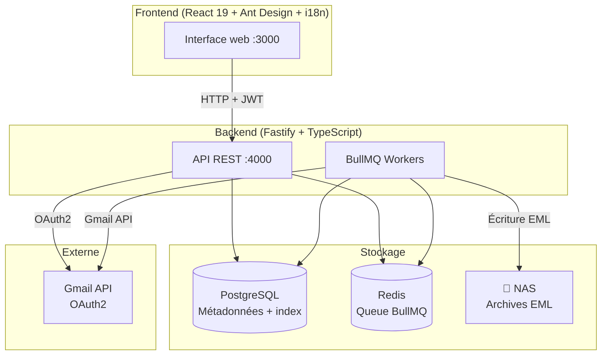
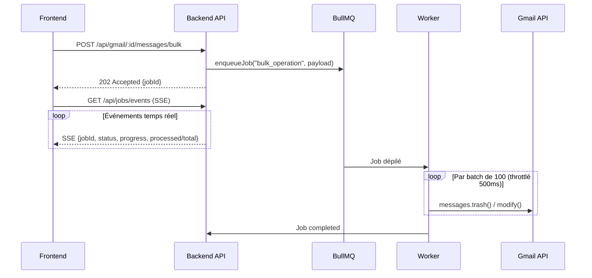
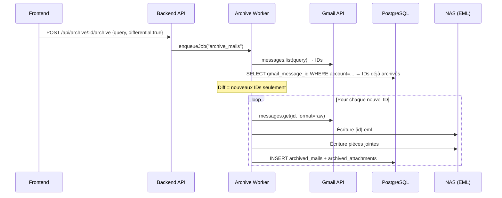
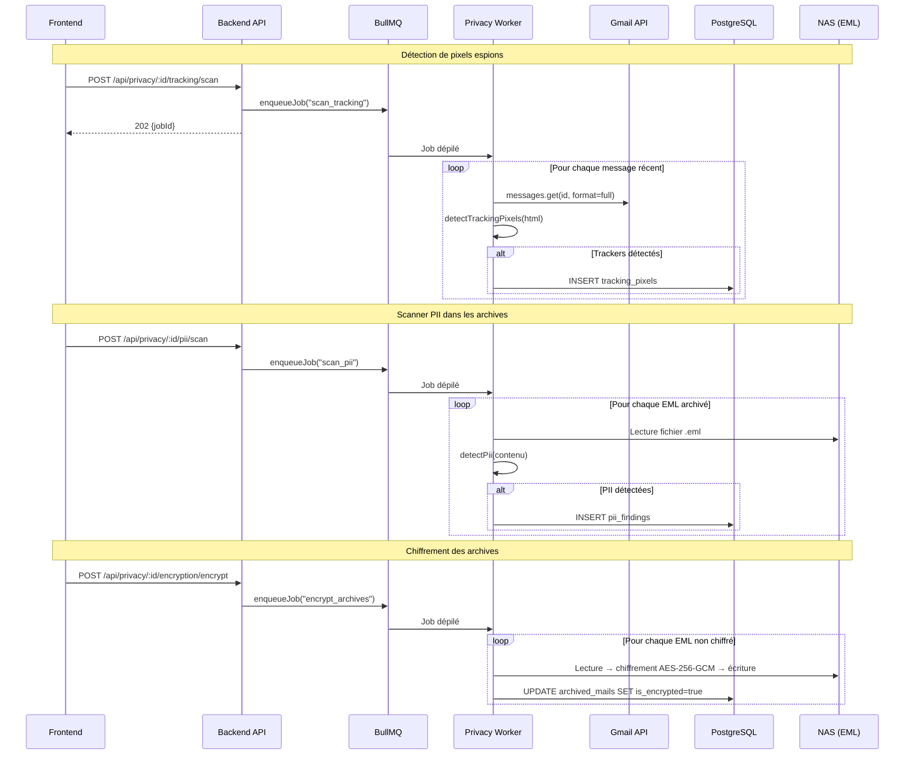

# Vue d'ensemble de l'architecture

## Diagramme général



---

## Flux d'une opération bulk



---

## Flux d'archivage différentiel



---

## Flux de scan vie privée



---

## Décisions d'architecture

### EML plutôt que mbox

Le format mbox stocke tous les mails dans un seul fichier par dossier. Cela rend le différentiel complexe (besoin d'un index externe) et fragilise les archives (un fichier corrompu = tout le dossier perdu).

EML (1 fichier par mail) permet :

- Un diff simple par comparaison d'IDs dans PostgreSQL
- La lecture directe d'un mail sans parser le reste
- La résistance à la corruption
- Un stockage des pièces jointes proprement séparé

### BullMQ pour toutes les opérations longues

Gmail API avec 5 000 mails implique potentiellement plusieurs minutes de traitement. Faire ça en synchrone HTTP (timeout à 30s) est impossible.

BullMQ permet :

- La progression temps réel (polling frontend)
- La reprise en cas d'erreur (retry avec backoff exponentiel)
- L'annulation d'un job en cours
- La concurrence contrôlée (max 3 jobs bulk en parallèle, 1 pour l'archivage)

### PostgreSQL pour les métadonnées

Les métadonnées des mails archivés (expéditeur, sujet, date, taille) sont indexées dans PostgreSQL avec un index `tsvector` pour la recherche full-text. Cela évite de parser les fichiers EML pour chaque recherche.

### Chiffrement au repos des archives

Les archives EML peuvent être chiffrées sur le NAS avec AES-256-GCM. La clé est dérivée de la phrase secrète de l'utilisateur via PBKDF2 (SHA-512, 100 000 itérations). À aucun moment la phrase secrète n'est stockée — seul un hash scrypt de vérification est conservé en base.

Format binaire du fichier chiffré :

```
GMENC01 (7 B) | SALT (32 B) | IV (12 B) | AUTH_TAG (16 B) | CIPHERTEXT
```

Ce format permet le déchiffrement à la volée sans fichier temporaire, et la détection immédiate d'un fichier chiffré (magic bytes `GMENC01`).
