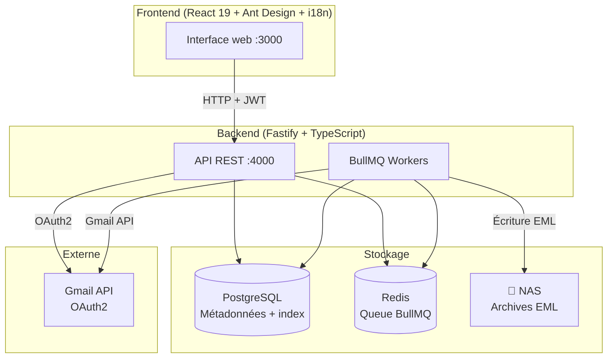
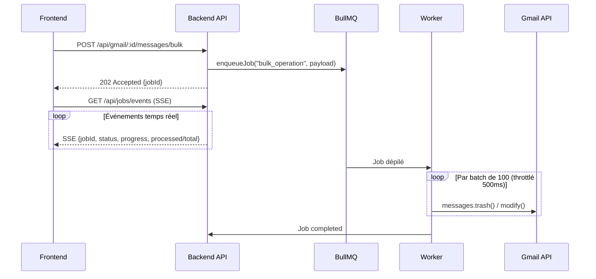
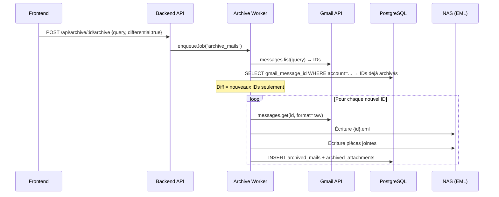
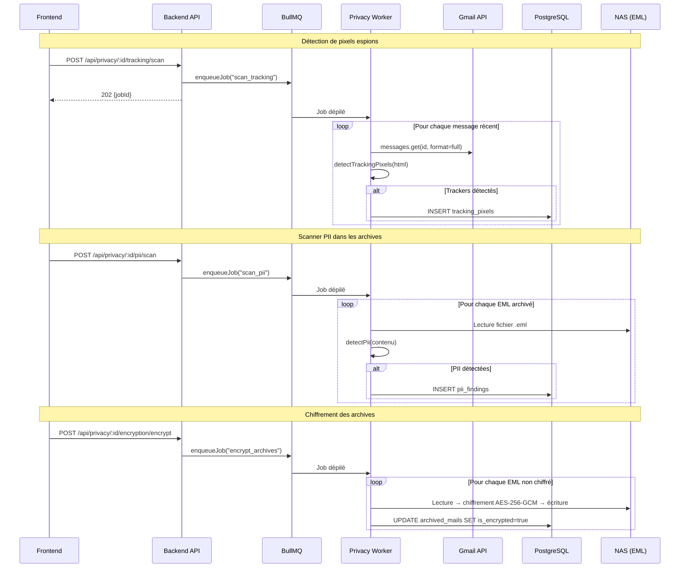

# Architecture Overview

## General Diagram



---

## Bulk Operation Flow



---

## Differential Archiving Flow



---

## Privacy Scan Flow



---

## Architecture Decisions

### EML Rather Than mbox

The mbox format stores all emails in a single file per folder. This makes differentials complex (requires an external index) and makes archives fragile (a corrupted file = the entire folder lost).

EML (1 file per email) allows:

- Simple diff by comparing IDs in PostgreSQL
- Direct reading of an email without parsing the rest
- Corruption resistance
- Properly separated attachment storage

### BullMQ for All Long-Running Operations

Gmail API with 5,000 emails can potentially require several minutes of processing. Doing this synchronously over HTTP (30s timeout) is impossible.

BullMQ allows:

- Real-time progress (frontend polling)
- Error recovery (retry with exponential backoff)
- Cancellation of a running job
- Controlled concurrency (max 3 bulk jobs in parallel, 1 for archiving)

### PostgreSQL for Metadata

Archived email metadata (sender, subject, date, size) is indexed in PostgreSQL with a `tsvector` index for full-text search. This avoids parsing EML files for each search.

### At-Rest Encryption of Archives

EML archives can be encrypted on the NAS with AES-256-GCM. The key is derived from the user's passphrase via PBKDF2 (SHA-512, 100,000 iterations). The passphrase is never stored — only a scrypt verification hash is kept in the database.

Binary format of the encrypted file:

```
GMENC01 (7 B) | SALT (32 B) | IV (12 B) | AUTH_TAG (16 B) | CIPHERTEXT
```

This format allows on-the-fly decryption without temporary files, and immediate detection of an encrypted file (magic bytes `GMENC01`).
