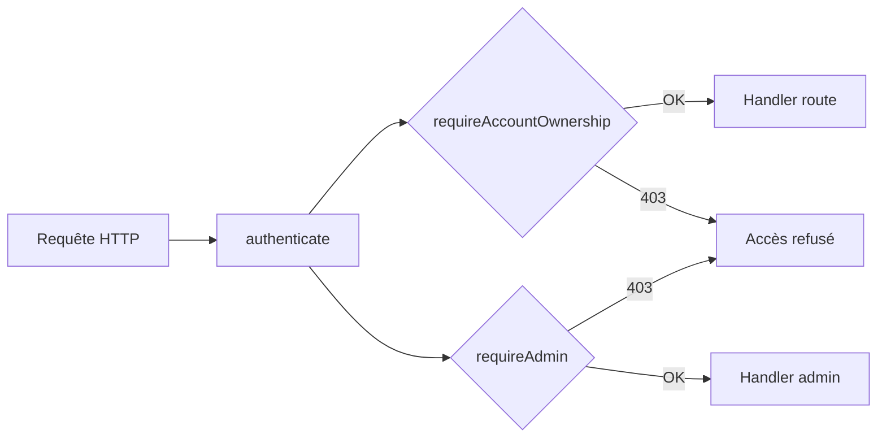

# Security

Overview of the security measures implemented in Nid.

---

## Authentication

### httpOnly JWT

JWT tokens are stored in **httpOnly cookies**, inaccessible to client-side JavaScript. This protects against XSS attacks that would attempt to steal tokens.

- **Access token**: short duration (15 min by default), used for every API request
- **Refresh token**: long duration (30 days by default), used only to renew the access token

### Redis JWT Blacklist

On logout, the token is added to a Redis blacklist. The `authenticate` middleware checks this blacklist on every request, enabling **immediate invalidation** of a compromised token.

### Password Hashing

Passwords are hashed with **bcrypt** (12 rounds). A dummy hash is computed even when the user doesn't exist, which prevents account enumeration through timing attacks.

### Rate Limiting

| Route | Limit |
|---|---|
| `POST /api/auth/register` | 3 requests / minute |
| `POST /api/auth/login` | 5 requests / minute |
| General routes | 100 requests / minute / IP |

### 2FA TOTP

Two-factor authentication is optional for local accounts. It uses **TOTP** (RFC 6238) via `otplib`, with QR code generation for setup.

### Multi-Provider SSO

Social Login uses the **Arctic** library with server-side OAuth2 code exchange. Social tokens never transit through the frontend.

Supported providers: Google, Microsoft, Discord, Facebook, LinkedIn, Keycloak.

---

## Authorization

### Multi-User Isolation

Two Fastify decorators ensure data isolation:

- **`requireAccountOwnership`** — Verifies that the `:accountId` parameter belongs to the authenticated user. Applied on all Gmail, archive, dashboard, and rules routes.
- **`requireAdmin`** — Verifies that `role === 'admin'` in the JWT. Applied on admin and integrity routes.



### Roles

| Role | Access |
|---|---|
| `user` | Own data (emails, archives, rules, jobs, notifications) |
| `admin` | Same + administration page (users, global jobs, quotas, integrity) |

---

## Input Validation

All user inputs are validated with **Zod**:

- Strict schemas on request bodies, query params, and URL parameters
- TypeScript types inferred from Zod schemas
- Automatic rejection of unknown fields

Full-text search uses `plainto_tsquery` (not `to_tsquery`), which neutralizes query operators and protects against PostgreSQL operator injection.

---

## Archive Encryption

EML archives can be encrypted at rest on the NAS:

| Parameter | Value |
|---|---|
| Algorithm | AES-256-GCM (confidentiality + integrity) |
| Key derivation | PBKDF2 (SHA-512, 100,000 iterations) |
| Salt | 32 random bytes per file |
| IV | 12 random bytes per file |
| Passphrase storage | Scrypt hash in database — never the passphrase itself |

### Binary Format

```
GMENC01 (7 B) | SALT (32 B) | IV (12 B) | AUTH_TAG (16 B) | CIPHERTEXT
```

- Magic bytes `GMENC01` for encrypted file detection
- On-the-fly decryption without temporary files
- Idempotency: already encrypted files are skipped

---

## Network Security

### Production

- PostgreSQL and Redis are **not exposed** on the host
- Only port 3000 (Nginx) is accessible
- CORS configured for `FRONTEND_URL` only

### Webhooks

Webhooks of type `generic` include an `X-Webhook-Signature` header containing an HMAC-SHA256 of the payload, allowing the recipient to verify the request's authenticity.

---

## File Security

- Filenames in `Content-Disposition` headers are sanitized
- File paths are validated to prevent directory traversal
- EML files are identified by UUID, not by user-provided paths

---

## Audit

All sensitive actions are tracked in the audit log:

| Category | Tracked Actions |
|---|---|
| Authentication | Login, logout, registration, failed login |
| Gmail accounts | Account connection, disconnection |
| Rules | Creation, modification, deletion, execution |
| Bulk operations | Deletion, archiving, label modification |
| Configuration | Export, import |
| Administration | User modification, role change |

Each entry includes the request's IP address for traceability.

---

## Docker Container Security

### Base Images

- **Alpine images** — Systematic use of Alpine variants to reduce the attack surface (fewer binaries, fewer potential CVEs)
- **Updates** — `apk upgrade --no-cache` in production to apply security patches

### Multi-Stage Build

Dockerfiles use a **multi-stage build** (builder → deps → runner) so the final image contains:

- No source code
- No devDependencies
- No build tools (npm, corepack, yarn)

### Non-Root User

All production images run with a **non-root user** (`appuser:appgroup`, UID/GID 1001). This limits the impact of a potential compromise of the Node.js process.

### `.dockerignore`

`.dockerignore` files prevent copying sensitive files into the build context:

- `.env`, `.env.*`, `*.pem`, `*.key` — Environment variables and secrets
- `.git` — Git history
- `node_modules`, `coverage`, `dist` — Build artifacts
- `volumes/` — User data

### Internal Network

In production, PostgreSQL and Redis are **not exposed** on the host — they communicate only through the Docker internal network. Only port 3000 (Nginx) is accessible.

### `--ignore-scripts`

Production `npm ci` commands use `--ignore-scripts` to prevent execution of potentially malicious `postinstall` scripts in dependencies.
