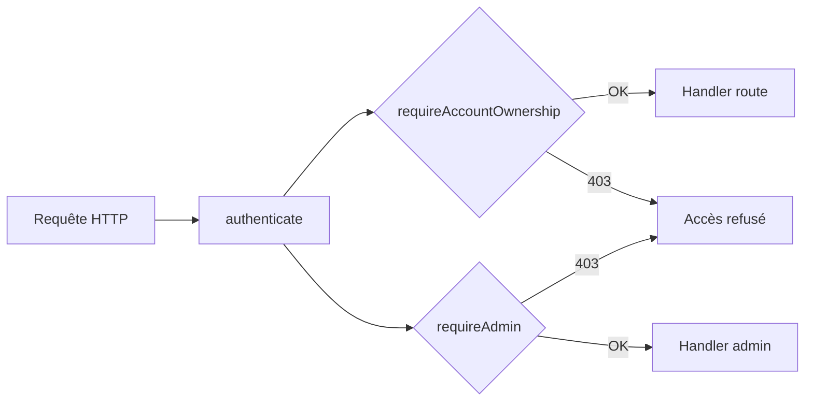

# Sécurité

Vue d'ensemble des mesures de sécurité implémentées dans Nid.

---

## Authentification

### JWT httpOnly

Les tokens JWT sont stockés dans des **cookies httpOnly**, inaccessibles au JavaScript côté client. Cela protège contre les attaques XSS qui tenteraient de voler les tokens.

- **Access token** : durée courte (15 min par défaut), utilisé pour chaque requête API
- **Refresh token** : durée longue (30 jours par défaut), utilisé uniquement pour renouveler l'access token

### Blacklist JWT Redis

Au logout, le token est ajouté à une blacklist Redis. Le middleware `authenticate` vérifie cette blacklist à chaque requête, permettant l'**invalidation immédiate** d'un token compromis.

### Hashage des mots de passe

Les mots de passe sont hashés avec **bcrypt** (12 rounds). Un hash factice est calculé même quand l'utilisateur n'existe pas, ce qui empêche l'énumération de comptes par timing attack.

### Rate limiting

| Route | Limite |
|---|---|
| `POST /api/auth/register` | 3 requêtes / minute |
| `POST /api/auth/login` | 5 requêtes / minute |
| Routes générales | 100 requêtes / minute / IP |

### 2FA TOTP

L'authentification à deux facteurs est optionnelle pour les comptes locaux. Elle utilise **TOTP** (RFC 6238) via `otplib`, avec génération de QR code pour la configuration.

### SSO multi-providers

Le Social Login utilise la librairie **Arctic** avec échange de code OAuth2 côté serveur. Les tokens sociaux ne transitent jamais par le frontend.

Providers supportés : Google, Microsoft, Discord, Facebook, LinkedIn, Keycloak.

---

## Autorisation

### Isolation multi-utilisateurs

Deux décorateurs Fastify assurent l'isolation des données :

- **`requireAccountOwnership`** — Vérifie que le paramètre `:accountId` appartient à l'utilisateur authentifié. Appliqué sur toutes les routes Gmail, archive, dashboard et règles.
- **`requireAdmin`** — Vérifie que `role === 'admin'` dans le JWT. Appliqué sur les routes admin et intégrité.



### Rôles

| Rôle | Accès |
|---|---|
| `user` | Ses propres données (mails, archives, règles, jobs, notifications) |
| `admin` | Idem + page administration (utilisateurs, jobs globaux, quotas, intégrité) |

---

## Validation des entrées

Toutes les entrées utilisateur sont validées avec **Zod** :

- Schémas stricts sur les corps de requête, query params et paramètres d'URL
- Types TypeScript inférés depuis les schémas Zod
- Rejet automatique des champs inconnus

La recherche full-text utilise `plainto_tsquery` (et non `to_tsquery`), ce qui neutralise les opérateurs de requête et protège contre l'injection d'opérateurs PostgreSQL.

---

## Chiffrement des archives

Les archives EML peuvent être chiffrées au repos sur le NAS :

| Paramètre | Valeur |
|---|---|
| Algorithme | AES-256-GCM (confidentialité + intégrité) |
| Dérivation de clé | PBKDF2 (SHA-512, 100 000 itérations) |
| Salt | 32 octets aléatoires par fichier |
| IV | 12 octets aléatoires par fichier |
| Stockage passphrase | Hash scrypt en base — jamais la passphrase elle-même |

### Format binaire

```
GMENC01 (7 B) | SALT (32 B) | IV (12 B) | AUTH_TAG (16 B) | CIPHERTEXT
```

- Magic bytes `GMENC01` pour la détection des fichiers chiffrés
- Déchiffrement à la volée sans fichier temporaire
- Idempotence : les fichiers déjà chiffrés sont ignorés

---

## Sécurité réseau

### Production

- PostgreSQL et Redis ne sont **pas exposés** sur l'hôte
- Seul le port 3000 (Nginx) est accessible
- CORS configuré sur `FRONTEND_URL` uniquement

### Webhooks

Les webhooks de type `generic` incluent un header `X-Webhook-Signature` contenant un HMAC-SHA256 du payload, permettant au destinataire de vérifier l'authenticité de la requête.

---

## Sécurité des fichiers

- Les noms de fichiers dans les headers `Content-Disposition` sont sanitisés
- Les chemins de fichiers sont validés pour empêcher les traversées de répertoire
- Les fichiers EML sont identifiés par UUID, pas par des chemins utilisateur

---

## Audit

Toutes les actions sensibles sont tracées dans le journal d'audit :

| Catégorie | Actions tracées |
|---|---|
| Authentification | Connexion, déconnexion, inscription, échec de login |
| Comptes Gmail | Connexion, déconnexion d'un compte |
| Règles | Création, modification, suppression, exécution |
| Opérations bulk | Suppression, archivage, modification de labels |
| Configuration | Export, import |
| Administration | Modification d'utilisateur, changement de rôle |

Chaque entrée inclut l'adresse IP de la requête pour la traçabilité.

---

## Sécurité des conteneurs Docker

### Images de base

- **Images Alpine** — Utilisation systématique de variantes Alpine pour réduire la surface d'attaque (moins de binaires, moins de CVE potentielles)
- **Mises à jour** — `apk upgrade --no-cache` en production pour appliquer les correctifs de sécurité

### Build multi-stage

Les Dockerfiles utilisent un **build multi-stage** (builder → deps → runner) pour que l'image finale ne contienne :

- Ni le code source
- Ni les devDependencies
- Ni les outils de build (npm, corepack, yarn)

### Utilisateur non-root

Toutes les images de production tournent avec un **utilisateur non-root** (`appuser:appgroup`, UID/GID 1001). Cela limite l'impact d'une éventuelle compromission du processus Node.js.

### `.dockerignore`

Des fichiers `.dockerignore` empêchent la copie de fichiers sensibles dans le contexte de build :

- `.env`, `.env.*`, `*.pem`, `*.key` — Variables d'environnement et secrets
- `.git` — Historique Git
- `node_modules`, `coverage`, `dist` — Artefacts de build
- `volumes/` — Données utilisateur

### Réseau interne

En production, PostgreSQL et Redis ne sont **pas exposés** sur l'hôte — ils communiquent uniquement via le réseau Docker interne. Seul le port 3000 (Nginx) est accessible.

### `--ignore-scripts`

Les commandes `npm ci` de production utilisent `--ignore-scripts` pour empêcher l'exécution de scripts `postinstall` potentiellement malveillants dans les dépendances.
